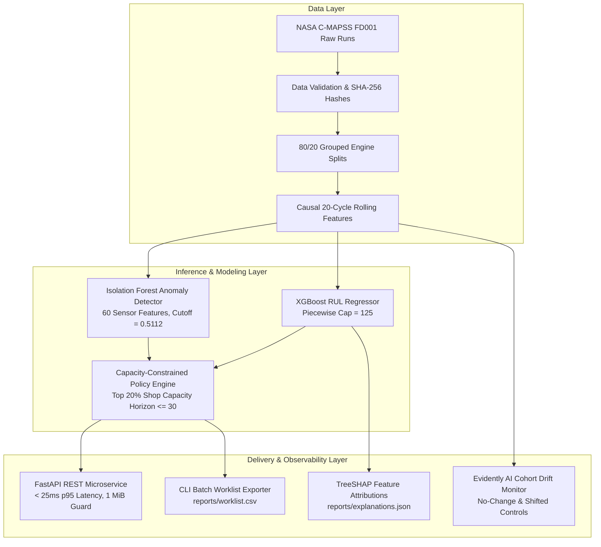

# TurbineGuard: Turbofan Predictive Maintenance & RUL Estimator

[](https://www.python.org/)
[](https://fastapi.tiangolo.com/)
[](https://xgboost.ai/)
[](https://scikit-learn.org/)
[](https://www.evidentlyai.com/)
[](tests/)
[](docs/06_VALIDATION_AND_RELEASE.md)
[-blue.svg?style=flat)](models/v0.2.0/)
[](https://opensource.org/licenses/MIT)

**TurbineGuard** is a production-grade predictive maintenance machine learning system for turbofan Remaining Useful Life (RUL) estimation, sensor anomaly isolation, and capacity-constrained maintenance worklist prioritization developed on the NASA C-MAPSS FD001 dataset.

---

## 1. System Architecture & Pipeline



---

## 2. Key Capabilities & Engineering Standards

- **Piecewise-Capped RUL Regression**: Gradient boosted decision tree (XGBoost) champion model utilizing causal backward-looking 20-cycle rolling features (mean, standard deviation, linear trend/slope, and instantaneous values), achieving **16.21 RMSE** on the official 100-engine holdout test set (Target $\le 25.0$ cycles: **ACHIEVED**).
- **High-Precision Critical Band**: Near-failure band ($RUL \le 30$ cycles) achieves **6.98 RMSE** and **5.17 MAE**.
- **Separate Sensor Anomaly Isolation**: Dedicated Isolation Forest component fitted strictly on 80 development engines (3,727 high-RUL proxy rows) across 60 sensor features with a frozen 99th percentile cutoff ($0.5112$), achieving a **$0.54\%$ false-flag rate** on healthy validation engines (Gate G4 $\le 5.0\%$: **PASS**).
- **Capacity-Constrained Prioritization Policy**: Deterministically prioritizes turbofans within maintenance horizons ($\le 30$ cycles) for a 20% shop inspection capacity, achieving **95.0% Precision@k** (19 of 20 shop slots filled with critical engines; **3.80x lift** over baseline prevalence).
- **Local & Global Explainability**: Native TreeSHAP feature attributions and signed expected-value contributions for every prediction without external lookahead leakage.
- **Evidently AI Drift Monitoring**: Automated reference vs. batch monitoring with controls for no-change baseline (0 drift), $+2\sigma$ shifted sensor detection, and sample size guards ($N < 30$).
- **Stateless FastAPI Microservice**: Production REST endpoints (`/health`, `/ready`, `/model-info`, `/predict`) with strict Pydantic schemas, 1 MiB body limits, consecutive cycle validation, and **$23.19\text{ ms}$ p95 scoring latency**.

---

## 3. Validation Gates Scorecard

All system milestones are strictly governed by reproducible cryptographic validation gates:

| Gate | Description & Acceptance Criteria | Result | Evidence |
| :--- | :--- | :--- | :--- |
| **G1 Data** | Source archive SHA-256 verification, zero missing values, 80/20 disjoint engine split manifests | **PASS** | [`reports/data_quality.json`](reports/data_quality.json), [`data/source_manifest.json`](data/source_manifest.json) |
| **G2 Leakage** | Causal backward-looking rolling features (window=20), zero future row leakage, zero cross-engine leakage | **PASS** | [`tests/test_features.py`](tests/test_features.py), [`tests/test_splits.py`](tests/test_splits.py) |
| **G3 RUL Promotion** | Validation RMSE $\ge 10\%$ improvement over median (E01) and age-only (E02) baselines | **PASS** | $+71.37\%$ vs E01, $+44.24\%$ vs E02; [`reports/validation_metrics.json`](reports/validation_metrics.json) |
| **G4 Anomaly Promotion** | $\ge 30$ fitting engines, $\ge 10$ val engines, high-RUL macro false-flag rate $\le 5.0\%$ | **PASS** | 80 dev / 20 val engines, $0.54\%$ false-flag rate; [`reports/validation_metrics.json`](reports/validation_metrics.json) |
| **G5 Engineering** | CLI vs API parity $\le 10^{-6}$ cycles, 59/59 pytest passing, ruff 0 errors, p95 $< 200\text{ ms}$ | **PASS** | [`reports/runtime.json`](reports/runtime.json), [`tests/test_batch.py`](tests/test_batch.py) |
| **G6 Monitoring** | Evidently drift report, no-change baseline (0 drift), $+2\sigma$ shifted-sensor control detected | **PASS** | [`reports/drift/controls/control_results.json`](reports/drift/controls/control_results.json) |
| **G7 Traceability** | Cryptographically signed model bundle receipts, full Model Card, frozen release bundle | **COMPLETE** | [`reports/official_test_metrics_v0.2.0.json`](reports/official_test_metrics_v0.2.0.json), [`docs/MODEL_CARD.md`](docs/MODEL_CARD.md) |

---

## 4. Empirical Benchmarks

### 5-Fold Grouped Cross-Validation (80 Development Engines)
```
========================================================================================
EXPERIMENT COMPARISON (5-Fold Grouped CV across 80 Development Engines)
----------------------------------------------------------------------------------------
E01: Dummy Regressor (Median)           | RMSE: 50.92 cycles (±0.85) | Baseline
E02: Ridge Regression (Age-only)        | RMSE: 29.27 cycles (±0.67) | Baseline
E03: Ridge Regression (Sensor-only)     | RMSE: 18.29 cycles (±0.61) | Baseline
E04: XGBoost (Current values)           | RMSE: 16.87 cycles (±0.58) | Candidate
E05: XGBoost (Current + Rolling-20)     | RMSE: 14.49 cycles (±0.59) | SELECTED CHAMPION
----------------------------------------------------------------------------------------
DIAGNOSTIC RUNS
----------------------------------------------------------------------------------------
E06: Champion without Cycle/Age         | RMSE: 15.41 cycles (±0.57) | Sensor-only signal
E07: Champion with Uncapped Target      | RMSE: 18.84 cycles (±0.66) | Proves 125 cap value
========================================================================================
```

### Official NASA C-MAPSS FD001 Holdout Evaluation (100 Engines - Release `v0.2.0`)
```
========================================================================================
OFFICIAL HOLDOUT METRICS (100 Test Engines)
----------------------------------------------------------------------------------------
Overall Holdout RMSE:            16.21 cycles (Target <= 25.0: ACHIEVED)
Overall Holdout MAE:             12.02 cycles
NASA Asymmetric Score:           383.71 (Mean: 3.84)
----------------------------------------------------------------------------------------
ERROR METRICS BY OPERATIONAL RUL BAND
----------------------------------------------------------------------------------------
Near-Failure Band (RUL <= 30):   RMSE: 6.98 cycles  | MAE: 5.17 cycles  (25 engines)
Intermediate Band (31-100):      RMSE: 15.88 cycles | MAE: 12.42 cycles (42 engines)
Long-RUL Band (RUL > 100):       RMSE: 20.94 cycles | MAE: 16.69 cycles (33 engines)
----------------------------------------------------------------------------------------
MAINTENANCE POLICY & ANOMALY RESULTS
----------------------------------------------------------------------------------------
Worklist Precision@k (top 20%):  95.0% (19/20 selected engines near failure, 3.80x lift)
Worklist Recall@30d:             76.0% (19/25 near-failure engines captured in top 20%)
Anomaly Detection (IForest):     Cutoff 0.5112 | Flagged: 37 total (17 investigate, 20 review_soon)
========================================================================================
```

---

## 5. Quickstart & Reproduction Guide

### Step 1: Environment Setup
```powershell
# Clone repository and create virtual environment
python -m venv .venv
.\.venv\Scripts\Activate.ps1   # On Linux/macOS: source .venv/bin/activate

# Install locked dependencies
pip install -r requirements.lock
pip install -e . --no-deps
```

### Step 2: Data Acquisition & Preprocessing
```powershell
# Download and verify raw NASA C-MAPSS dataset
python scripts/download_data.py --dataset FD001 --output data/raw/FD001

# Execute QA validation, 80/20 engine splits, and causal rolling feature extraction
python -m turbineguard.cli prepare --config configs/default.yaml
```

### Step 3: Model Training & Gate Validation
```powershell
# Train baseline models (E01 Median, E02 Age-only, E03 Sensor-Ridge)
python -m turbineguard.cli train --config configs/default.yaml --experiment baselines

# Train XGBoost candidate models and select champion via 1-SE rule
python -m turbineguard.cli train --config configs/default.yaml --experiment xgboost

# Train 60-feature Isolation Forest anomaly detector
python -m turbineguard.cli train --config configs/default.yaml --experiment anomaly

# Evaluate validation gates G3 (RUL) and G4 (Anomaly)
python -m turbineguard.cli evaluate --config configs/default.yaml --split validation

# Freeze validated release bundle (v0.2.0)
python -m turbineguard.cli freeze --config configs/default.yaml --version v0.2.0

# Run official holdout evaluation (hashes predictions before opening test labels)
python -m turbineguard.cli evaluate --config configs/default.yaml --split official-test --bundle models/v0.2.0 --release-id v0.2.0 --allow-heldout-evaluation
```

### Step 4: Batch Inference & Monitoring
```powershell
# Score batch trajectories to generate ranked inspection worklist
python -m turbineguard.cli score --bundle models/v0.2.0 --input data/raw/FD001/test_FD001.txt --input-format cmapss --output reports/worklist.csv

# Generate SHAP feature attributions
python -m turbineguard.cli explain --bundle models/v0.2.0 --input data/raw/FD001/test_FD001.txt --output reports/explanations.json --top-k 5

# Run Evidently drift analysis and automated control tests
python -m turbineguard.cli drift --bundle models/v0.2.0 --current reports/worklist_features.parquet --output reports/drift
python -m turbineguard.cli drift-controls --bundle models/v0.2.0 --output reports/drift/controls
```

### Step 5: Test Suite & Code Quality
```powershell
# Run the complete test suite (59 unit, integration, parity, and contract tests)
pytest -q

# Run Ruff linter
ruff check src scripts tests api
```

---

## 6. REST API Serving

Start the FastAPI inference service using Uvicorn:

```powershell
python -m uvicorn api.main:app --host 127.0.0.1 --port 8000
```

- **Health Probe**: `GET http://127.0.0.1:8000/health`
- **Readiness Probe**: `GET http://127.0.0.1:8000/ready`
- **Model Metadata**: `GET http://127.0.0.1:8000/model-info`
- **Interactive OpenAPI Documentation**: `http://127.0.0.1:8000/docs`

### Example Request (`POST /predict`): Single Engine History
```json
{
  "unit_id": 1,
  "dataset_id": "FD001",
  "readings": [
    {
      "cycle": 1,
      "op_1": -0.0007,
      "op_2": -0.0004,
      "op_3": 100.0,
      "s01": 518.67, "s02": 641.82, "s03": 1589.70, "s04": 1400.60, "s05": 14.62,
      "s06": 21.61, "s07": 554.36, "s08": 2388.06, "s09": 9046.19, "s10": 1.30,
      "s11": 47.47, "s12": 521.66, "s13": 2388.02, "s14": 8138.62, "s15": 8.4195,
      "s16": 0.03, "s17": 392.0, "s18": 2388.0, "s19": 100.0, "s20": 39.06, "s21": 23.4190
    },
    "... [at least 20 consecutive cycles required] ..."
  ],
  "explain": true,
  "top_k": 3
}
```

### Example Response:
```json
{
  "unit_id": 1,
  "dataset_id": "FD001",
  "last_cycle": 31,
  "estimated_rul": 112.45,
  "within_horizon": false,
  "anomaly_score": 0.3842,
  "anomaly_flag": false,
  "priority": "routine_review",
  "bundle_version": "v0.2.0",
  "explanation": {
    "baseline_expected_value": 78.43,
    "top_contributions": [
      {
        "feature_name": "s11_mean_20",
        "attribution": 14.32,
        "feature_value": 47.51,
        "direction": "increases_rul"
      },
      {
        "feature_name": "s04_mean_20",
        "attribution": -8.76,
        "feature_value": 1404.2,
        "direction": "decreases_rul"
      }
    ]
  }
}
```

---

## 7. Docker Deployment

TurbineGuard includes a production-ready container definition configured with a non-root `appuser` and immutable volume mounting for frozen model bundles:

```powershell
# Build Docker container
docker build -t turbineguard:v0.2.0 .

# Run container with read-only model bundle mount
docker run -d -p 8000:8000 \
  -v "${PWD}/models/v0.2.0:/app/models/v0.2.0:ro" \
  --name turbineguard-api turbineguard:v0.2.0
```

---

## 8. Repository Layout & Documentation

```
01_TurbineGuard_Predictive_Maintenance/
├── api/                        # FastAPI service & strict Pydantic schemas
│   ├── main.py
│   └── schemas.py
├── configs/                    # Experiment and dataset configuration
│   └── default.yaml
├── data/                       # Raw & processed NASA C-MAPSS datasets (gitignored)
├── docs/                       # Specifications, PRD, architecture, and Model Card
│   ├── 00_START_HERE.md        # Execution guide & index
│   ├── 01_PROBLEM_AND_OBJECTIVES.md
│   ├── 02_PRD.md               # Product requirements document
│   ├── 03_DATA_SPEC.md         # Data contracts & leakage prevention rules
│   ├── 04_TECHNICAL_DESIGN.md  # Software architecture & stack policy
│   ├── 05_EXPERIMENT_PLAN.md   # Baseline, candidate & diagnostic protocols
│   ├── 06_VALIDATION_AND_RELEASE.md # Gate definitions (G1–G7)
│   ├── 07_OPERATIONS_AND_COMMANDS.md
│   ├── 08_DECISIONS_LOG.md     # Architectural Decision Records (D001–D017)
│   ├── 09_PROGRESS_LOG.md      # Detailed chronological session logs
│   ├── 11_MODEL_PERFORMANCE_REVIEW.md
│   ├── 12_IMPROVEMENT_PLAN.md  # Executed improvement plan
│   └── MODEL_CARD.md           # Formal ML Model Card
├── models/                     # Versioned immutable model bundles
│   ├── v0.1.0/                 # Preserved historical audit baseline
│   └── v0.2.0/                 # Clean promoted release candidate
├── reports/                    # Quality reports, metrics, drift HTML, and runtime logs
├── scripts/                    # Acquisition and runtime benchmarking scripts
│   ├── download_data.py
│   └── benchmark_runtime.py
├── src/turbineguard/           # Core library package
│   ├── anomaly.py              # 60-sensor Isolation Forest anomaly scoring
│   ├── artifacts.py            # Model bundling & cryptographic validation
│   ├── cli.py                  # CLI command dispatch
│   ├── config.py               # YAML configuration loader
│   ├── data.py                 # Ingestion & data quality checks
│   ├── evaluate.py             # RUL & policy evaluation metrics
│   ├── explain.py              # SHAP TreeExplainer attributions
│   ├── features.py             # Causal rolling feature extraction
│   ├── labels.py               # RUL labeling & anomaly proxy assignment
│   ├── monitoring.py           # Evidently drift analysis & control checks
│   ├── policy.py               # Inspection prioritization & capacity diagnostics
│   ├── splits.py               # Grouped disjoint engine splits & manifests
│   └── train.py                # Grouped CV training & champion selection
└── tests/                      # Pytest suite (59 passing tests)
```

---

## 9. Known Limitations & Operational Boundaries

1. **Near-Failure Recall Tradeoff**: 19 of 25 near-failure engines are captured in the top 20% inspection list (76.0% recall vs $\ge 80\%$ target). 5-fold CV residual analysis established that the 6 uncaught engines had true RULs of 21–29 cycles with predicted RULs of 30.4–45.3 due to gradual early degradation curves. Artificial offsets to force recall increase false alarms on healthy units.
2. **Piecewise Target Cap Plateau**: Healthy engines ($RUL > 125$) plateau near 125 cycles by design to focus capacity on near-failure urgency.
3. **Single Operating Regime**: Specifically designed for sea-level static operation (C-MAPSS FD001); multi-regime operation (FD002/FD004) requires condition normalization.
4. **Human Decision Support**: Designed for maintenance worklist ranking, not automated fly-by-wire actuator control.

---

## 10. Dataset Attribution & License

- **Dataset**: NASA C-MAPSS Turbofan Engine Degradation Simulation Dataset (FD001). Saxena, A., Goebel, K., Simon, D., & Eklund, N. (2008). *Damage Propagation Modeling for Aircraft Engine Run-to-Failure Simulation*. International Conference on Prognostics and Health Management.
- **License**: Released under the [MIT License](https://opensource.org/licenses/MIT).
