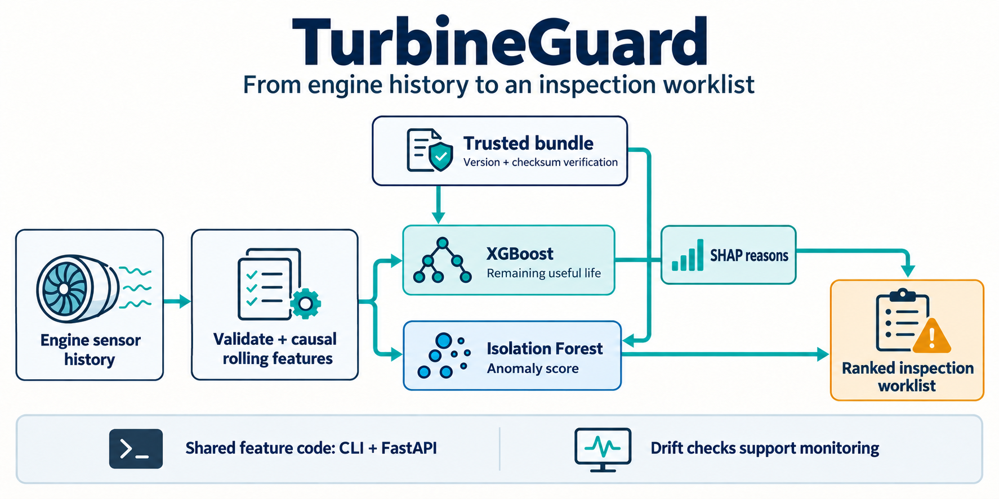

# TurbineGuard

**Predict engine remaining useful life and prioritize inspections from sensor history.**

[](https://github.com/luqshzeeq3601-art/01_TurbineGuard_Predictive_Maintenance/actions/workflows/ci.yml)
[](LICENSE)

TurbineGuard combines an XGBoost remaining-life model, an Isolation Forest anomaly detector and SHAP explanations behind a shared CLI and FastAPI service. It is a maintenance decision-support demonstrator evaluated on NASA C-MAPSS FD001.

## 1. Workflow



The same feature code serves training and inference. The portable `v0.2.1` bundle verifies file checksums before loading; its trained weights are identical to `v0.2.0`. SHAP explanations describe the RUL prediction. Drift checks support monitoring without automatically retraining the model.

## 2. Measured results

Official FD001 test set: **100 engines**. Measurements belong to the original weights, not a newly trained packaging revision.

| Measure | Saved result |
| --- | --- |
| RUL RMSE | **16.21 cycles** |
| RUL MAE | **12.02 cycles** |
| Precision in the top-20 inspection list | **95%** |
| Recall of the 25 engines with RUL <= 30 cycles | **76%** |

Evidence: [release summary](reports/release_v0.2.1_summary.json), [model card](docs/MODEL_CARD.md). Inspection-ranking figures are offline diagnostics; they do not measure equipment downtime or financial savings.

## 3. Quick start

### Run the packaged API with Docker

No NASA download or retraining is needed for the included portable model.

```sh
docker build -t turbineguard:local .
docker run --rm -p 127.0.0.1:8000:8000 turbineguard:local
```

Open [local API docs](http://127.0.0.1:8000/docs). With the service running, verify readiness and a synthetic prediction from another terminal:

```sh
python scripts/smoke_api.py
```

### Use Python locally

Use Python 3.11. Clone/download the same branch or revision as this README, then run from the repository root. The verified updates are currently in [draft PR 1](https://github.com/luqshzeeq3601-art/01_TurbineGuard_Predictive_Maintenance/pull/1) on `fix/portfolio-remediation`.

```sh
python -m venv .venv
```

Activate with `.\.venv\Scripts\Activate.ps1` in Windows PowerShell, or `source .venv/bin/activate` on Linux/macOS.

```sh
python -m pip install -r requirements.lock
python -m pip install --no-deps -e .
```

```sh
python -m uvicorn api.main:app --host 127.0.0.1 --port 8000
```

For batch scoring, explanations, drift and dataset reproduction, use the [operations guide](docs/07_OPERATIONS_AND_COMMANDS.md). Select the trusted `models/v0.2.1` bundle for portable inference. Preserve the frozen evaluation; repeated use of official test labels is not a new holdout.

## 4. API and verification

| Endpoint | Purpose |
| --- | --- |
| `GET /health` | Service liveness |
| `GET /ready` | Verified bundle loaded |
| `GET /model-info` | Model and bundle metadata |
| `POST /predict` | RUL, anomaly/priority information and optional explanations |

```sh
python -m pytest -q -p no:cacheprovider --basetemp .pytest_tmp
python -m ruff check src tests api
```

GitHub CI runs isolated tests plus an actual container readiness/prediction check. Four optional real-data/report checks can skip when their local-only inputs are absent; required public-source tests use synthetic histories and trusted temporary bundles.

## 5. Scope and delivery

- The input needs at least 20 consecutive engine cycles; the model is specific to the FD001 benchmark conditions.
- Anomaly training uses a high-RUL proxy subset, not independently labeled real faults.
- This tool supports inspection decisions. It does not control equipment or establish operational safety.
- Docker and local inference are verified. **Public hosted inference remains unverified**; deployment configuration alone does not prove a running service.

## 6. Documentation and contributions

[Start here](docs/00_START_HERE.md) · [Technical design](docs/04_TECHNICAL_DESIGN.md) · [Tasks](tasks/todo.md) · [Progress](docs/09_PROGRESS_LOG.md) · [Sources](docs/10_SOURCES.md) · [Diagram notes and prompt](docs/assets/workflow.md)

For contributions, follow [AGENTS.md](AGENTS.md), preserve the frozen data/model protocol, and include relevant verification in a pull request.

## 7. License and data

Code and project documentation use the [MIT license](LICENSE). NASA data has its own source terms and attribution; it is acquired separately. See [the source manifest](data/source_manifest.json) and [data specification](docs/03_DATA_SPEC.md).
