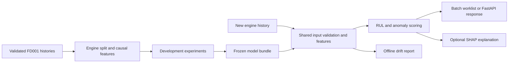

# 04. Technical design

## 1. Architecture



One package owns validation, features, scoring and policy. API and CLI are thin adapters. Training labels and retrospective evaluation functions stay outside the inference path. No database or persistent engine state is needed for the MVP.

## 2. Stack and version policy

| Component | Choice | Purpose |
|---|---|---|
| Language | CPython 3.11 | CPU development and serving |
| Tables | numpy, pandas, pyarrow | Parsing and processed Parquet |
| Models | scikit-learn, XGBoost | Baselines, preprocessing, regression and Isolation Forest |
| Explanations | SHAP | Tree or linear contributions |
| Config | YAML validated into typed settings | One versioned source of runtime parameters |
| Serving | FastAPI, Pydantic, Uvicorn | Stateless validated requests |
| Tracking | Local MLflow | Parameters, scores and run artifacts |
| Monitoring | Evidently | Feature-distribution reports |
| Quality | pytest, ruff | Behaviour verification and lint |
| Packaging | joblib, JSON metadata, Docker | Trusted local artifacts and Linux runtime |
| Automation | GitHub Actions workflow | Synthetic fixture checks, not expensive full training |

T01 verifies available tooling and pins a compatible set in requirements.lock. Do not assume ChurnGuard's package versions fit this project. Python 3.11 is the initial default; change it only with an environment compatibility decision. Verify version-specific APIs before implementing them.

## 3. Planned layout

```text
01_TurbineGuard_Predictive_Maintenance/
  README.md, AGENTS.md
  docs/                         Existing specifications and logs
  tasks/                        Existing plan and implementation tracker
  configs/default.yaml          Authoritative runtime defaults
  pyproject.toml, requirements.lock
  src/turbineguard/
    cli.py, config.py
    data.py, splits.py, labels.py
    features.py
    train.py, evaluate.py, anomaly.py
    artifacts.py, predict.py, policy.py, explain.py
    monitoring.py
  api/                          main.py and schemas.py
  tests/                        Unit/contract/integration tests
  tests/fixtures/               Small synthetic data only
  scripts/download_data.py
  data/raw/FD001/, data/processed/
  models/<bundle_version>/
  reports/, mlruns/
  Dockerfile, .dockerignore
  .github/workflows/ci.yml
```

Only documentation directories exist initially. Create implementation folders as their tasks need them. Keep raw/processed data, models, local tracking, machine-specific files and generated reports ignored by default. Curate safe final report summaries separately when publication is requested.

## 4. Module contracts

| Module | Input | Output |
|---|---|---|
| data | Local FD001 text or validated history table | Typed rows with provenance keys |
| splits/labels | Training rows only | Engine/fold manifests and separate targets |
| features | One or multiple causal histories plus persisted selectors | Stable named feature rows |
| train/anomaly | Development data and config | Fitted components and run evidence |
| artifacts | Trusted bundle directory | Validated loaded predictors and metadata |
| predict | Validated histories and bundle | RUL, anomaly scores and policy outputs |
| explain | RUL feature row and corresponding explainer | Contributions in cycles to raw model output |
| evaluate | Frozen predictions plus offline labels | Metrics and gate outcomes |
| monitoring | Frozen reference and current unlabeled features | Drift report and diagnostic summary |

Use snake_case and type hints. Separate pure transformations from I/O. Prefer a named result structure over ambiguous tuples. Example intended style:

```python
def is_within_horizon(estimated_rul_cycles: float, horizon_cycles: int) -> bool:
    return estimated_rul_cycles <= horizon_cycles
```

The example specifies the inclusive boundary. It is not an implemented function or a substitute for input validation.

## 5. Prediction API contract

### Endpoints

| Endpoint | Behaviour |
|---|---|
| GET /health | 200 when process is alive; include service version |
| GET /ready | 200 only when compatible RUL/anomaly bundle is loaded; otherwise 503 |
| GET /model-info | Bundle/policy/schema versions, horizon, cutoff, data scope and promotion status; 503 without bundle |
| POST /predict | One engine's history; 200 result, 422 invalid input, 413 oversized body, 503 unavailable bundle |

No batch HTTP endpoint in the MVP. CSV batch scoring uses the CLI.

### Request

- dataset_id: exactly FD001.
- engine_id: nonempty identifier, 1-64 characters, returned to the caller; never a predictor.
- history: 20-200 rows, ascending, unique consecutive positive integer cycle values.
- Each row has cycle, op_1, op_2, op_3 and s01-s21. All settings/sensors are required finite numbers.
- explain: Boolean, default false.
- Reject unknown fields, strings/Booleans masquerading as numbers, NaN and infinities.
- Application body cap: 1 MiB, enforced for both declared and streamed body size.
- Use final 20 rows to predict. Stateless requests must bring their own history.

### Response

| Field | Meaning |
|---|---|
| engine_id, dataset_id, latest_cycle, history_length | Request context |
| estimated_rul_cycles | max(0, raw RUL prediction) |
| within_horizon | Inclusive 30-cycle policy |
| anomaly_score, anomaly_cutoff, anomaly_flag | Distinct continuous score, cutoff and Boolean |
| inspection_priority | review_soon, investigate or routine_review |
| bundle_version, policy_version, schema_version | Traceability |
| explanation | null when not requested; otherwise raw_output, base_value, clipping_applied and top_contributions |

Explanation items carry feature name, feature value and signed contribution in cycles. Top-three contributions alone do not reconstruct the full prediction. Full contributions are available in the offline report. Explain the raw predictor before zero clipping; flag clipping explicitly.

## 6. Batch contract

Input CSV uses unit_id, cycle, op_1-op_3 and s01-s21. Validate the entire file before scoring. Fail with an engine-specific error rather than silently omitting invalid engines.

Return one row per engine's latest cycle. Sort by ascending estimated RUL, descending anomaly_flag and ascending string engine ID as a deterministic tie-breaker. A separate top-capacity view uses `max(1, ceil(0.20 * N))` engines. Report selected IDs, counts and the exact policy; never use true RUL to sort.

## 7. Bundle contract

models/<version>/ contains:

- rul_pipeline.joblib and anomaly_pipeline.joblib with their fitted preprocessing.
- policy.json: horizon, anomaly cutoff, score direction, capacity and priority rules.
- feature_schema.json: raw input schema, feature order, selectors and 20-cycle window.
- metadata.json: version, config/data/split hashes, dependency versions, seed, MLflow run ID, validation gates, validation-based promotion status and model file hashes.
- monitoring_reference.parquet and reference_manifest.json: frozen development snapshot features and the sampling/schema definitions, prepared during bundle freeze for later monitoring.
- explainability metadata/background derived only from development data, if required by the selected model.

Load only trusted, project-generated bundles; joblib deserialization is unsafe for untrusted files. Reject mismatched feature schemas or runtime compatibility. Load once at startup; no per-request model fitting. Mark a nonpromoted bundle explicitly as experimental in /model-info and reports. Promotion is based on G1-G4 validation evidence; it does not assert that later operational checks or official-test aspirations passed.

Before freezing, development runs use models/staging/ plus a run manifest identifying the active RUL/anomaly components and all input hashes. Evaluation checks this manifest rather than silently loading arbitrary latest model files. Freeze copies validated components into an immutable version directory. Explanation support data and monitoring reference are included at this point; later reports must not modify fitted models or policy. A final release report records G5-G7 separately from the frozen metadata.

## 8. Runtime and monitoring

The API has no upload-to-disk path, training endpoint or auto-retraining hook. Logs contain request ID, timing, versions and validation/error category, without dumping complete histories. Docker runs as a nonroot user and exposes only the service port. Local publication is not a cloud deployment.

Monitoring runs offline from validated batches, described in [the experiment plan](05_EXPERIMENT_PLAN.md). It never modifies the deployed bundle.
