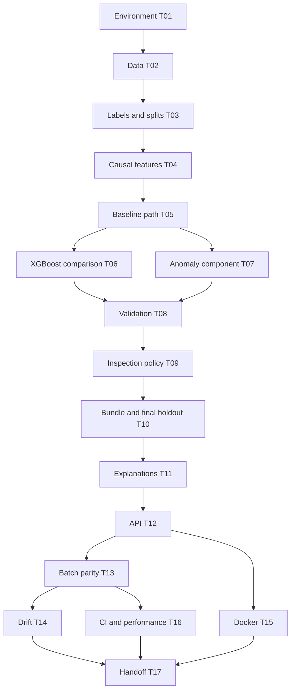

# TurbineGuard implementation plan

## 1. Delivery approach

Deliver one complete local path first: raw engine history -> validated causal features -> baseline estimate -> evaluation. Improve the model only after that path is trustworthy. Then freeze the bundle and add serving, explanations and monitoring through the same predictor.

The [PRD](../docs/02_PRD.md) defines scope. [tasks/todo.md](todo.md) is the only task tracker. This plan is a dependency/milestone map, not another copy of task completion status.

## 2. Effort and milestones

These estimates assume one developer on a CPU machine. The user has not committed weekly availability or a start date. Use relative weeks and reestimate after the baseline.

| Milestone | Tasks | Estimate | Relative timing | Exit evidence |
|---|---|---|---|---|
| M1 Reproducible data foundation | T01-T04 | 10-14 hours | Week 1-2 | Environment, provenance, manifests and leakage checks |
| M2 Baseline benchmark | T05 | 4-6 hours | Week 2 | End-to-end baseline metrics and run records |
| M3 Model and policy decision | T06-T09 | 12-18 hours | Week 3-4 | Bounded comparison, validation gates and worklist diagnostics |
| M4 Frozen evaluation and usable inference | T10-T13 | 10-14 hours | Week 4-5 | Frozen test report, explanation, API and CLI parity |
| M5 Operational evidence and handoff | T14-T17 | 9-13 hours | Week 5-7 | Drift controls, Docker/CI and model card |
| Total | T01-T17 | 45-65 hours | About 5-7 weeks at 10 hours/week | Local deliverable plus honest ML verdict |

No calendar deadline is invented. GPU work, a dashboard and cloud publishing are excluded from this estimate.

## 3. Dependency order

T06/T07 are logically independent after the baseline. T14-T16 have some independent work after shared contracts are stable. Execute sequentially by default; do not introduce agents or shared-file concurrency as a project requirement.

## 4. Checkpoints

1. **After T04:** manually inspect one engine and tiny fixtures. Confirm that future data cannot affect earlier features. Resolve leakage before model comparison.
2. **After T05:** confirm baseline metrics can be reproduced from raw data. Inspect long-RUL bias from the cap. Reestimate effort and actual hardware constraints.
3. **After T09:** verify promotion criteria and snapshot prevalence; record unpromoted components. Freeze decisions before touching official labels.
4. **After T13:** verify one real history through CLI and API returns the same output and explanation units.
5. **After T17:** verify all final claims are linked to evidence and remaining limitations are visible.

These are evidence reviews within authorized execution. Escalate material scope/protocol changes to the user; routine successful checks do not require repeated permission.

## 5. Risk register

| ID | Risk | Impact | Mitigation and trigger |
|---|---|---|---|
| R1 | Same-engine leakage | Invalid benchmark | Group splits; future-perturbation tests; stop modelling if G2 fails |
| R2 | Official holdout used for tuning | Inflated generalisation claim | Separate loaders; freeze before labels; release evaluation record |
| R3 | Small 20-engine validation sample | Uncertain promotion | Paired engine intervals, group counts, clear snapshot sampling assumptions |
| R4 | Proxy anomaly labels mistaken for truth | Misleading diagnosis | Score separately, name proxies, report support and false-flag limitations |
| R5 | Target cap biases long-RUL estimates | Optimistic headline | Uncapped primary metrics, RUL-band errors and declared sensitivity study |
| R6 | NASA link/bytes change | Reproducibility failure | Manifest/hash checks, preserve source citation; investigate before substitutions |
| R7 | SHAP/library compatibility | Serving/explanation failure | Pin versions; raw-output additivity test; match explainer to model |
| R8 | API feature mismatch | Wrong live predictions | One shared builder/predictor; parity test after serialization |
| R9 | Scope expands to UI/cloud/streaming | Delayed core delivery | PRD boundaries; ship local inference before extensions |
| R10 | CPU tuning too slow | Schedule slip | <=30 configurations; record time; prefer simpler competitive model |
| R11 | Natural degradation triggers drift | Noisy alerts | Stage-mix diagnostics, explicit reference/current sampling and no automatic retraining |
| R12 | Docker unavailable | Container evidence missing | Continue data/model work; mark G5 unverified until actual smoke test |

Review risks at each milestone and after a failed check. Update assumptions with evidence, not invented completion dates.

## 6. Ownership and Definition of Done

- **Project manager:** select next ready task, maintain scope/effort/risks and record blockers.
- **ML engineer:** validate labels/splits, run controlled experiments, deliver a reusable predictor.
- **Reviewer role:** inspect leakage, contracts and claimed metrics before accepting a milestone. This is a responsibility, not a requirement to spawn an agent.
- **User:** owns changes to purpose, stakeholder assumptions and external publishing decisions.

Each task is done when its acceptance criteria pass, verification output is recorded, relevant documentation reflects the implementation and tasks/todo.md is updated. Model tasks additionally link to reproducible run evidence. A failed numerical goal stays failed; writing an explanation does not convert it to a pass.

## 7. Change control and stop condition

Record material changes in [the decision log](../docs/08_DECISIONS_LOG.md) and update the owning contract before dependent code. Preserve original official evaluation reports if a bug requires a rerun.

Stop MVP expansion when the local reproducible scoring path, reports, API, container, CI and monitoring evidence are complete. A dashboard, cloud demo, different dataset or new model family needs its own scoped follow-up.
